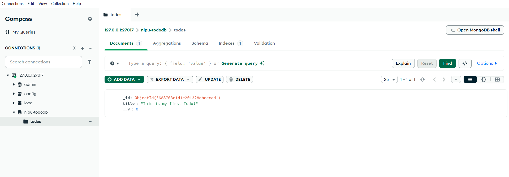

# TO-DO-MONGODB

This project is a basic Express + MongoDB backend that demonstrates how to:

- Connect to MongoDB using Mongoose
- Define a simple schema (`Todo`) with validation
- Perform a single insert operation
- View the inserted data using MongoDB Compass

---

## Tech Stack

- Node.js
- Express
- MongoDB (local)
- Mongoose
- dotenv

---

## MongoDB Schema

```js
const todoSchema = new mongoose.Schema({
  title: {
    type: String,
    required: true,
  },
});
```

---

## MongoDB Schema Verification

Below is a screenshot of the inserted Todo item as seen in **MongoDB Compass**.

> The schema automatically created the `todos` collection after saving the first document.

### Screenshot


